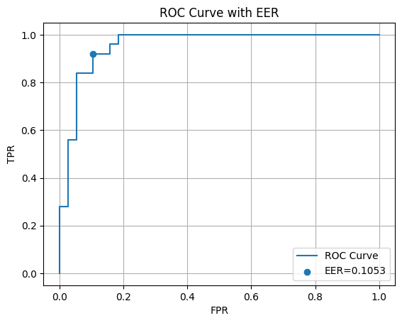
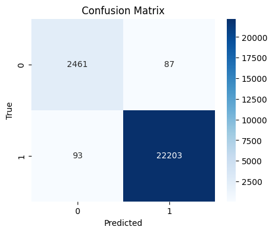
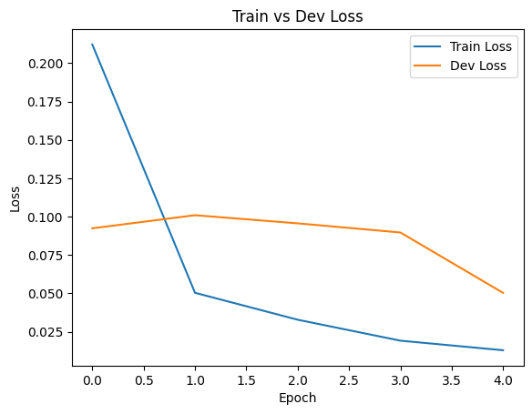
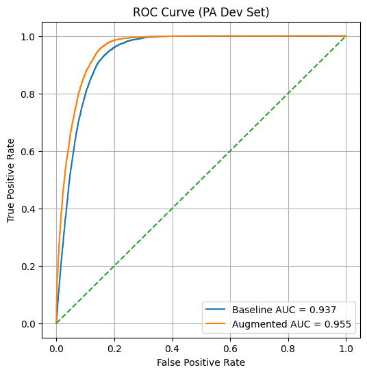
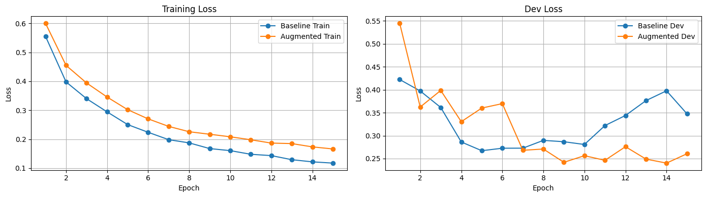
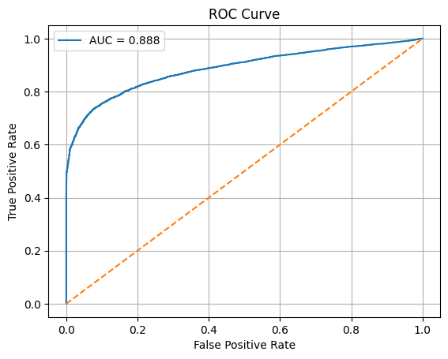
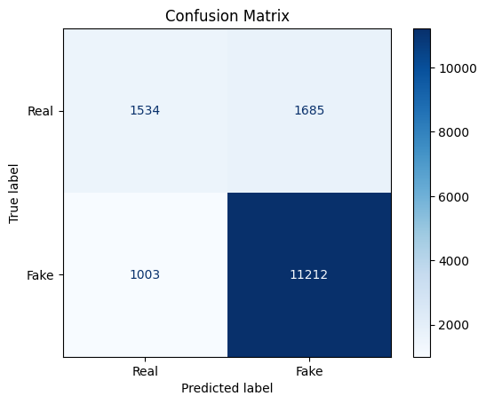

# 🎙️ Deepfake Voice Detection System

This project presents a deepfake speech detection system using a Light Convolutional Neural Network (LCNN). The system distinguishes between real and AI-generated speech signals using time–frequency representations.

---

## 📌 Project Overview

With the rapid development of text-to-speech (TTS) and voice cloning technologies, detecting synthetic speech has become increasingly important. This project investigates deep learning-based approaches for detecting deepfake audio and evaluates model performance across different datasets.

---

## 🧠 Methodology

### 🔹 Feature Extraction

* Audio signals are resampled to **16 kHz**
* **Log-Mel spectrograms** are extracted
* Delta and delta-delta features are included

### 🔹 Model

* **Light Convolutional Neural Network (LCNN)**
* Max-Feature-Map (MFM) activation
* Batch Normalization and Dropout

### 🔹 Training Strategy

* Cross-entropy loss with class weighting
* Cosine annealing learning rate scheduler
* Data augmentation:

  * Additive noise
  * Time masking
  * Frequency masking

---

## 📂 Datasets

### 🔹 ASVspoof2019

* **LA (Logical Access):** synthetic speech (TTS/VC)
* **PA (Physical Access):** replay attacks

### 🔹 Custom Dataset

* ~26 speakers
* Turkish recordings
* Fake samples generated using AI tools (e.g., ElevenLabs)

---

## 📊 Results

| Experiment  | Metric                       |
| ----------- | ---------------------------- |
| LA Baseline | Accuracy: 99.27%, EER: 1.41% |
| PA Baseline | EER: 11.01%                  |
| LA → Custom | EER: 6.67%                   |
| PA → Custom | EER: 18.76%                  |

---

## 📈 Example Results

### 🔹 LA Baseline

**ROC Curve**

**Confusion Matrix**

**Training Loss**

**Noise Robustness**

---

### 🔹 PA Baseline

**ROC Curve**

**Training Loss**

---

### 🔹 Cross-Dataset (PA → Custom)

**ROC Curve**

**Confusion Matrix**

---

## 📊 Full Results

You can view all experiment outputs in the [results folder](results/)

---

## ⚙️ Technologies

* Python
* PyTorch
* Librosa
* NumPy
* Scikit-learn
* Google Colab

---

## 🔍 Key Insights

* The model achieves **high performance on matched datasets (LA)**
* Performance drops significantly in **cross-dataset scenarios**
* PA-trained models struggle to generalize to synthetic speech
* Domain mismatch is a major challenge in deepfake detection

---

## 🚀 Future Work

* Improve cross-dataset generalization
* Apply domain adaptation techniques
* Integrate pretrained models (e.g., Wav2Vec2)
* Develop a real-time web application

---

## 👩‍💻 Author

**Rabia Buse Menteş**
Electrical & Electronics Engineering Student
Focus: Signal Processing & Machine Learning

